# Smart Med Station — Hardware & Electronics Design Document

| | |
|---|---|
| **Version** | v2.1 "Med Tower", physics-checked (2026-10-07). Supersedes v1 (2026-10-05) and v2.0; see [§10](#10-changes-from-v1). |
| **Scope** | Hardware + electronics of the class prototype. App software (UI, dose engine, logging) is out of scope except the device interface. |
| **Companion doc** | [technical-doc.md](technical-doc.md): BOM, pin map, wiring, serial protocol, firmware spec, bring-up tests |
| **Source** | [`proj3handoff.md`](../../proj3handoff.md) (concept, research, draft requirements) |
| **Diagrams** | [`diagrams/`](diagrams/), hand-authored SVG |

This document explains **what** we are building and **why**. The technical doc explains **how** to wire, program and test it.

---

## 1. Purpose and scope

### 1.1 Confirmed intent

| | |
|---|---|
| **Outcome** | A table-top working prototype of the Smart Med Station hardware, plus the docs needed to CAD, wire and program it. |
| **Users** | The builder (CAD, firmware, host software, written with coding agents), then the graders at the live demo. |
| **Timeline** | About 2 months (live demo around early December 2026). |
| **Success** | The live demo shows: protocol select → the tower turns to that drug → exactly **one** vial drops into the pickup tray → the weight drop and an RFID tap verify it → event logged. Controlled substances additionally require **PIN + RFID badge**. Restocking exposes **one column at a time**. Hatch-override and shake (tamper) events are logged. It runs reliably for a few minutes on a table. |
| **Constraint** | **$30** of new parts. On hand: Orange Pi 5, BBC micro:bit V2, KittenBot robot:bit, **MG90S servos only** (any other servo comes out of the budget), display, laptop, unlimited 3D printing. |
| **Out of scope** | App software beyond the serial interface. CAD geometry (owned by the team's CAD lead). Vehicle-grade robustness (vibration, 12 V vehicle power, steel safe). Automated draw-up. Real drugs. Clinical claims. |

### 1.2 Demo storyline the hardware must support

1. **Regular drug:** the medic picks *Anaphylaxis*, enters the weight, and sees the dose in mg and mL. The tower turns, and one epinephrine vial drops into the tray. Tapping it gives a green check. Tapping a deliberately wrong vial gives a red block and an alarm.
2. **Controlled drug:** the medic picks *Pediatric seizure*, enters a PIN and taps a badge. One midazolam vial drops into the tray, the weight check passes, and the automatic count updates on screen.
3. **Restock:** a supervisor plus a witness log in. The tower turns the fentanyl column under the hatch, the hatch unlatches, and only that column is reachable.
4. **Tamper:** the presenter opens the hatch with the override key, and the log shows **OVERRIDE**. Shaking the tower logs **SHOCK**.

---

## 2. Architecture overview

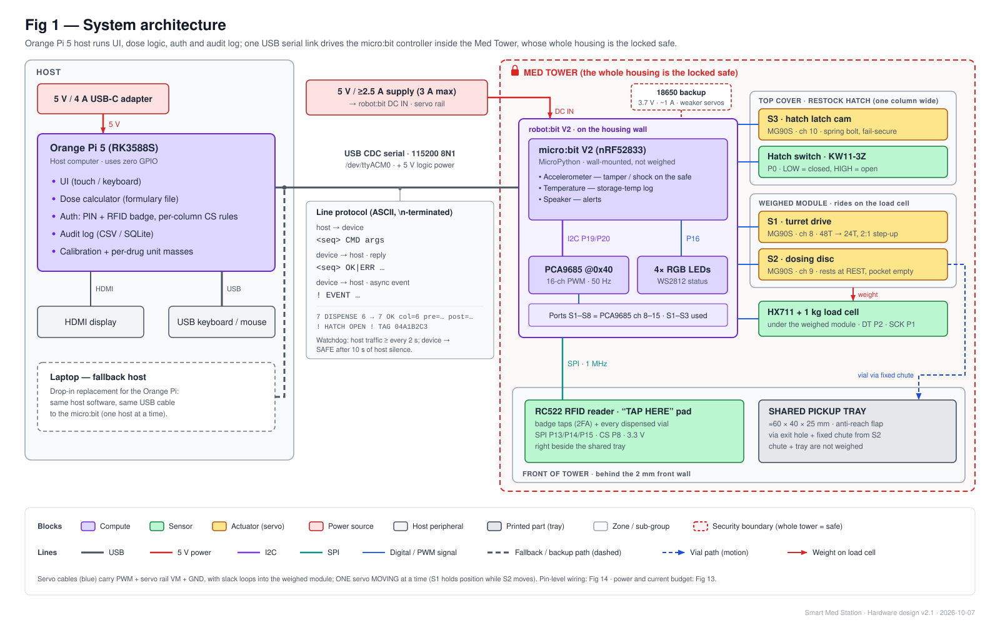

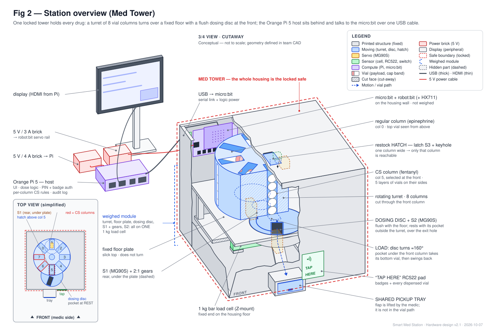

**Host vs device split**

| Layer | Hardware | Responsibilities |
|---|---|---|
| **Host** | Orange Pi 5 + HDMI display + USB keyboard/mouse (laptop is a drop-in fallback) | UI and dose calculation from the formulary file. Authentication (PIN + badge) and per-column rules (which columns are controlled). Deciding *what* to dispense. Audit log (CSV/SQLite). Calibration and per-drug unit masses. |
| **Link** | One USB cable | USB serial (115200 baud) carrying ASCII commands, replies and events; also powers the micro:bit logic |
| **Device** | micro:bit V2 in robot:bit, mounted **inside** the tower on the housing wall | Real-time I/O: 3 servos, RFID reader, load cell, hatch switch, accelerometer, temperature. Enforces hardware interlocks. Makes **no** authorization decisions. |

The host never touches a GPIO pin. That's what lets the laptop replace the Orange Pi on demo day: same cable, same protocol.

---

## 3. Key design decisions

### D1. The micro:bit + robot:bit is the only I/O controller

| Option | Verdict |
|---|---|
| **A. micro:bit runs all I/O; Orange Pi runs UI/logic over USB serial** | **Chosen** |
| B. RC522 on Orange Pi SPI4 | Rejected. It needs Linux device-tree overlays, the laptop fallback would lose RFID, and there would be two I/O stacks to debug. |
| C. USB "keyboard-emulation" RFID reader | Rejected. It costs about 40% of the budget, and tags give an ID only. |

**Why A:** it is the cheapest option and has the fewest demo-day failure points. It also gives one 3.3 V wiring domain, a timing-safe MCU for the load cell and servo ramps, and a clean interface for agent-written code. v2 uses 7 of the robot:bit's 8 GPIO, leaving P12 spare.

### D2. One unified tower for all drugs

| Option | Verdict |
|---|---|
| **One turret tower: regular and controlled columns side by side; the whole housing is the safe** | **Chosen**: one drive, one release, one tray, one load cell, 3 servos |
| v1: pick-through carousel with a latched door + a separate CS box | Superseded. Two modules, 5 servos, a single-drug CS compartment, and the medic reaches in to pick. |
| Dispensing carousel + separate CS turret sharing a tray | Rejected. Two drives and two release mechanisms (5 servos) for the same job. |
| One tower with controlled drugs on an inner ring behind their own hatch | Deferred to the product path. It gives physical CS separation but adds a second dosing disc and hatch (+2 servos). |

**How controlled substances stay isolated in a shared tower:**
1. **The whole housing is the locked safe.** The DEA rule summary in the handoff requires controlled drugs in a separately locked cabinet; it doesn't forbid regular drugs inside it. *Verify against the rule text.*
2. **Dispensing is isolated in software, per column:** controlled columns need PIN + badge.
3. **Restocking is isolated mechanically:** the hatch is exactly one column wide, so only the column turned under it can be reached. Controlled columns need 2FA + a witness before the hatch unlocks.

### D3. Turret drive: 180° servo with 2:1 printed step-up gears

| Option | Verdict |
|---|---|
| **MG90S + 48T:24T gears (turret turns 2× the servo angle)** | **Chosen**: free, knows its absolute position, needs no homing |
| 28BYJ-48 stepper | Rejected. The robot:bit's stepper API is timed, not counted, and turns the coils off. It would need custom step counting, a home switch and $4. |
| Continuous-rotation servo + index sensor | Rejected. It overshoots, has no absolute position, and needs a sensor pin. |

**Trade-offs we accept:**
- Torque at the turret is halved.
- The column stacks drag on the floor plate, so the floor must be slick (friction µ ≤ 0.2, checked by a tilt test). With that and the lighter vials, S1 needs about 79 mN·m at the horn, 44% of the MG90S's 181 mN·m stall (2.3× margin; see [technical-doc §13](technical-doc.md#13-engineering-calculations)).
- Each column has a 22.5° servo step, so the 8 columns use a 157.5° sweep. Each servo's real travel must be verified (R5).

### D4. No detent: the servo positions the turret

A spring detent was considered and **rejected on the physics**. To pull the turret to center against the stack drag, a detent would need about 55 mN·m at the turret. S1 would then need about 202 mN·m to climb out of each notch, more than the MG90S's 177 mN·m stall.

**What replaces it:**
- **One-direction approach:** S1 always makes its final approach to a column from the same side (lower pulse values), so gear backlash is taken up the same way every time.
- **Holding during a dispense:** S1 stays powered until the dosing disc is back at rest.
- **Holding when idle:** stack friction plus the servo gearbox hold the turret.
- **Accuracy:** the calibrated error budget is ±1.4 mm (RSS). With ±1.0 mm of column play that's about ±1.7 mm, inside the pocket's ±3.0 mm capture.
- **Cost:** ENV-2 ("mechanical lock when idle") becomes partial; a positive lock or brake is on the product path.

### D5. One flush dosing disc; the turret does the selecting

| Option | Verdict |
|---|---|
| **Flush dosing disc: a disc set into the floor with its top flush; one pocket moves between LOAD (under the front column) and REST (outside the turret, over the exit hole)** | **Chosen**: 2 servos (turret + disc) for any number of drugs; no dip when columns cross |
| v2.0 drop slot + release drum under it | Rejected after the physics pass. A crossing column's bottom vial dips 3.7 mm into the slot and needs about +45 mN·m at the turret to climb out, which pushes S1 to near stall. |
| Linear slider pocket (servo + crank) | Rejected. It works, but the crank adds parts and backlash. |
| One drum per drug (parallel magazines) | Rejected. One servo per drug, and lower capacity. |
| A single pocket moving under fixed magazines | Rejected. The pocket would fill from the first magazine it passes. |

**How the disc works:**
- **Two positions, about 160° apart:** REST → LOAD (one vial drops in) → REST (the vial falls through the exit hole).
- **The pocket rests outside the turret footprint,** so no column can drop into it while the turret turns.
- **Torque is never an issue:** the disc needs only about 13 mN·m (14× margin).

### D6. Restock hatch with a spring bolt + one-sided servo cam

The v1 latch design moves to the single restock hatch in the top cover:
- **Fail-secure:** power loss leaves the hatch locked.
- **Self-latching:** closing the hatch relocks it.
- **Mechanical key override always works** (SAF-2, CS-7). Any opening outside an unlock window is reported as `FORCED` and logged as **OVERRIDE**.

12 V solenoids were rejected (12 V supply, driver, budget), and so was a bolt attached to the servo horn (a key override would back-drive the servo gearbox).

### D7. Verification: RFID tap at the shared tray

| Option | Verdict |
|---|---|
| **RC522 reader + NTAG213 sticker tags; tap pad beside the tray** | **Chosen**: about $15 total. One reader serves badge taps (auth) and vial taps (verification). |
| Webcam barcode | Rejected. Aiming, lighting and mounting are hard at a fixed station. |
| USB barcode scanner | Rejected. About $20+. |

**Realism note:** US drug packages carry a GS1 DataMatrix barcode (DSCSA), and hospital RFID tracking (e.g., Fresenius Kabi +RFID / Kit Check) uses UHF tags. The product would use a DataMatrix imager plus optional UHF; the prototype uses 13.56 MHz NTAG as a stand-in.
**Every dispensed vial is tapped,** regular and controlled alike.

### D8. One load cell weighs the whole module; each drug has a known unit mass

The turret, floor plate, dosing disc, drive gears and the S1/S2 servos sit together on one platform on a 1 kg load cell.
- **Every dispense is checked:** the drop must equal that drug's unit mass within ±1.2 g.
- **Dummy masses are deliberately distinct:** regular drugs 6 g, controlled drugs 9 / 12 / 15 g. A mis-loaded column therefore shows up immediately. (The masses were lowered from 8/11/14/17 g in the physics pass to cut drag and weight by 20%.)
- **Shift count:** total mass is reconciled against the dispense log. If a single vial is missing, the size of the gap identifies its drug class.
- **Mass budget:** about 730 g of the cell's 1 kg: printed structure ≤ 450 g plus 330 g of vials (R3).
- **Rejected alternative:** a load cell under the tray. It would verify each dispense but could not measure stock (CS-5).

### D9. Controller lives inside the safe

The micro:bit and robot:bit mount on the housing wall, not on the weighed module. The built-in **accelerometer** becomes the tower's tamper and shock sensor, and the **temperature sensor** logs storage temperature (ENV-4), both at no cost.

### D10. Firmware: MicroPython; host owns calibration; plain-text protocol

- **MicroPython on the V2:** readable, testable from the REPL, and agent-friendly. It has no `machine.Pin`, `machine.SPI` or `json`, so the drivers are ported to `microbit.spi` and pin objects.
- **Fallback:** if HX711 timing fails in MicroPython (R4), port to MakeCode (the `pxt-myHX711` extension exists).
- **Calibration on the host:** servo positions, load-cell calibration and per-drug masses live on the host and are pushed to the device at connect.

### D11. Power: separate servo supply, one servo at a time

The Orange Pi has its own 5 V/4 A adapter. The micro:bit logic is powered over USB. The 3 MG90S servos run from a separate 5 V supply into the robot:bit (18650 backup). Only one servo **moves** at a time (S1 holds position while S2 moves), and PWM goes off when a cycle ends, so the peak is about 1 A and there are no brown-outs.

---

## 4. Mechanisms

### 4.1 The tower

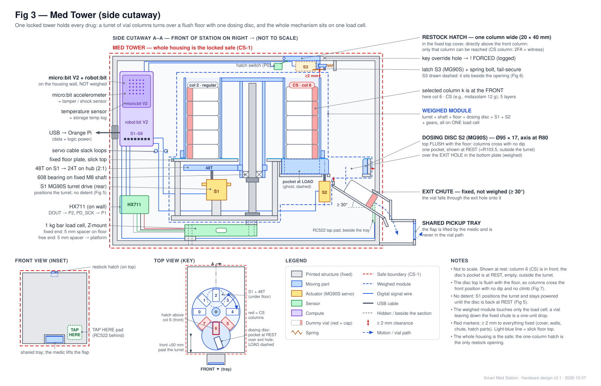

| Part | Summary |
|---|---|
| **Turret** (rotating, weighed) | 8 columns at 45° on R55, each 18 × 38 mm inside, holding 5 layers of Ø16 × 35 vials lying on their sides. **40 units** (32 if weight-limited). Spins on a fixed M8 shaft + 608 bearing. |
| **Floor plate** (fixed, weighed) | 3 mm, slick top (µ ≤ 0.2); a recess at the front holds the dosing disc flush with the floor |
| **Drive** | S1 MG90S + 48T:24T gears under the plate at the rear |
| **Dosing disc** | S2 MG90S directly under it. Ø95 × 17, flush with the floor, axis at R80 on the front line. One pocket moves between LOAD (under the front column) and REST (outside the turret, over the exit hole). |
| **Exit** | Exit hole under the disc's REST position → fixed chute (≥ 30°) → **shared pickup tray** at the front. The medic lifts a flap to take the vial; the flap is never in the vial's path. The RFID tap pad is right beside the tray. |
| **Restock hatch** | In the fixed top cover, directly above the front column; one column wide; latch S3 + switch + key |
| **Housing** | The safe. Printed for the prototype (steel for the product). About 200 mm internal height; footprint about 180 mm wide × 230 mm deep (the disc adds about 50 mm at the front), plus wall space for electronics (final geometry in CAD). |

### 4.2 Turret, dosing disc and drive

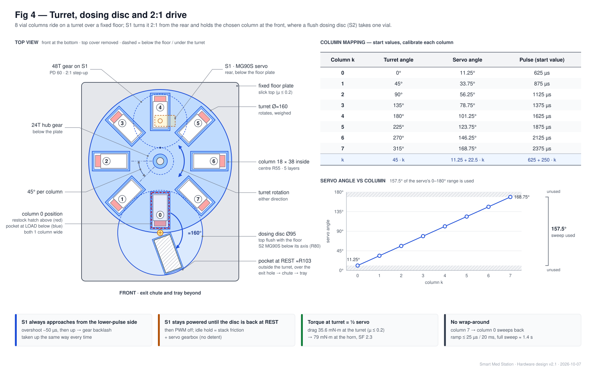

- **Selecting a column:** column *k* is selected when it sits at the front, over the disc's LOAD position and under the hatch.
- **One-direction approach:** S1 always finishes a move from the lower-pulse side, overshooting by 50 µs first if needed.
- **Servo angles:** column *k* is at a servo angle of 11.25° + 22.5° × *k*. Start values are 625 + 250 × *k* µs; each column is calibrated on the bench.
- **Moves are ramped:** about 2° of servo travel per 20 ms, so a full sweep takes about 1.4 s.

### 4.3 Turret positioning and torque budget

| Check | Value |
|---|---|
| S1 torque needed (µ ≤ 0.2, full stock) | 79 mN·m at the horn vs 181 stall at 5 V: **2.3× margin** (1.7× on the 3.7 V battery) |
| Servo speed under that load | About 330 °/s vs the 112 °/s ramp |
| Positioning error at the column (calibrated, one-direction approach) | ±1.4 mm RSS; about ±1.7 mm with column play, vs ±3.0 mm pocket capture |
| Holding when idle | Stack friction + gearbox. A hand-turn override needs about 1 N at a column wall. |

### 4.4 Restock hatch latch

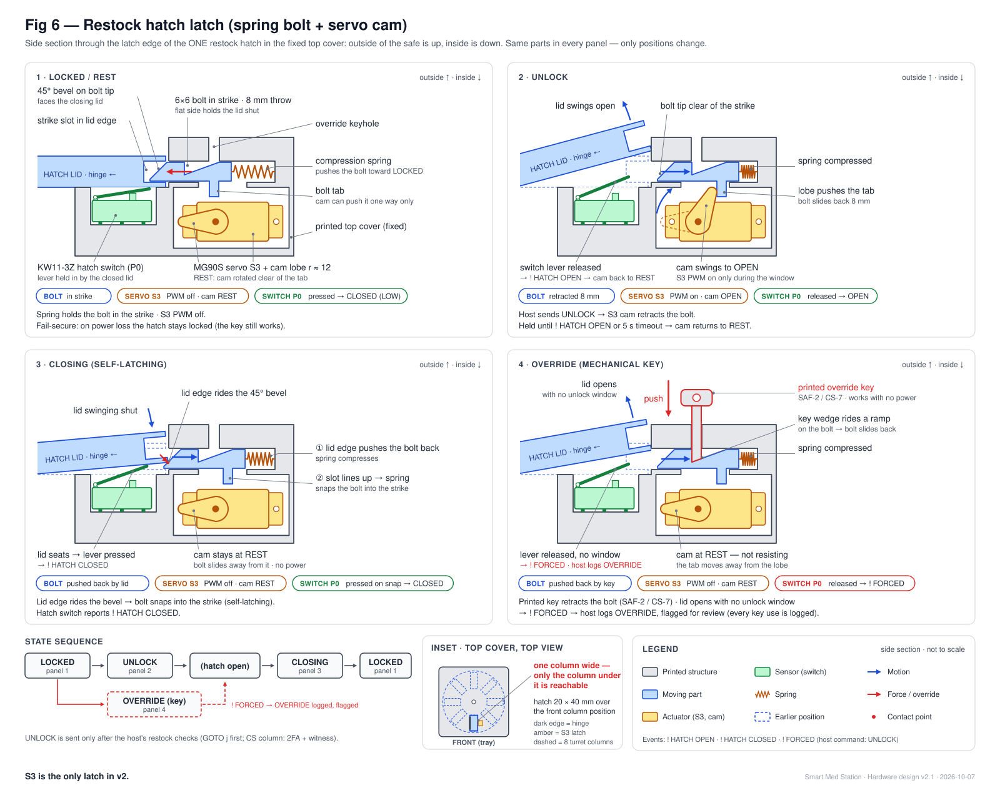

| State | Mechanism | Device event |
|---|---|---|
| Locked / rest | Spring pushes the bolt into the strike; cam clear; servo unpowered | (none) |
| Unlock window | Cam pushes the bolt back until the hatch opens or 5 s pass (max 10 s), then returns to rest | `! HATCH OPEN` |
| Closing | Lid edge rides the 45° bevel; the bolt snaps in | `! HATCH CLOSED` |
| Override | Key pushes the bolt; the cam doesn't resist | `! FORCED` → logged **OVERRIDE** |

### 4.5 Dosing-disc cycle and weight check

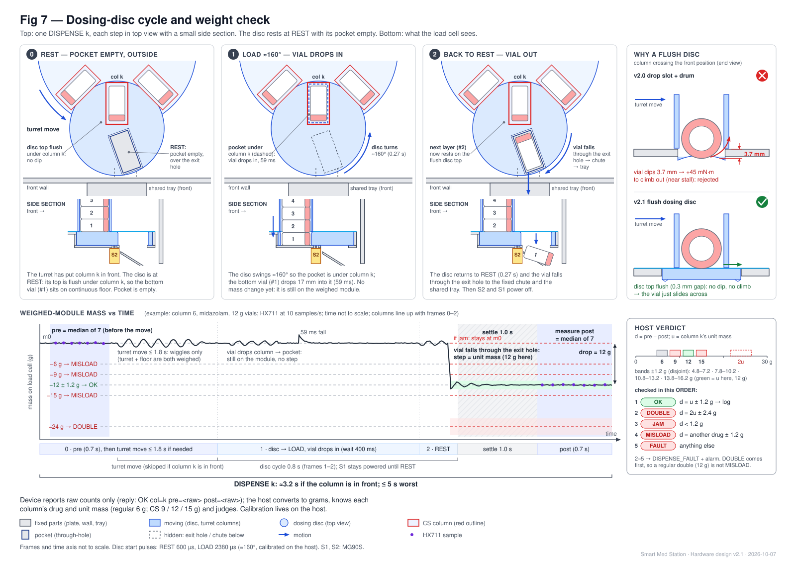

**Disc cycle:** REST (pocket empty, outside the turret) → LOAD (the pocket moves under the column and the bottom vial drops in, 59 ms) → REST (the vial falls through the exit hole, down the chute to the tray). S1 holds the turret throughout.

**Timing:** a dispense takes about 3.2 s if the column is already in front, and ≤ 5 s in the worst case including the turret move.

**Weight check:** the pre-dispense weight is taken before the turret moves; nothing can leave while the disc is at REST. Then the device reports raw pre and post readings, and the host judges the drop against the drug's unit mass:

| Drop | Verdict |
|---|---|
| = unit mass ± 1.2 g | OK |
| ≈ 0 | JAM |
| ≈ 2 units | DOUBLE |
| Matches another drug's mass | MISLOAD |

Anything other than OK raises `DISPENSE_FAULT` and an alarm.

**Order of the checks matters.** The host always knows which drug it expected (from the column), so it tests the drop against that drug first: OK (1 × unit ± 1.2 g), then DOUBLE (2 × unit ± 2.4 g), then JAM (< 1.2 g). Only after those does it test whether the drop matches another drug's band (MISLOAD). Otherwise a regular double (2 × 6 = 12 g) would be misread as a midazolam (12 g) MISLOAD.

### 4.6 Multi-layer columns: feeding, crossing and restocking

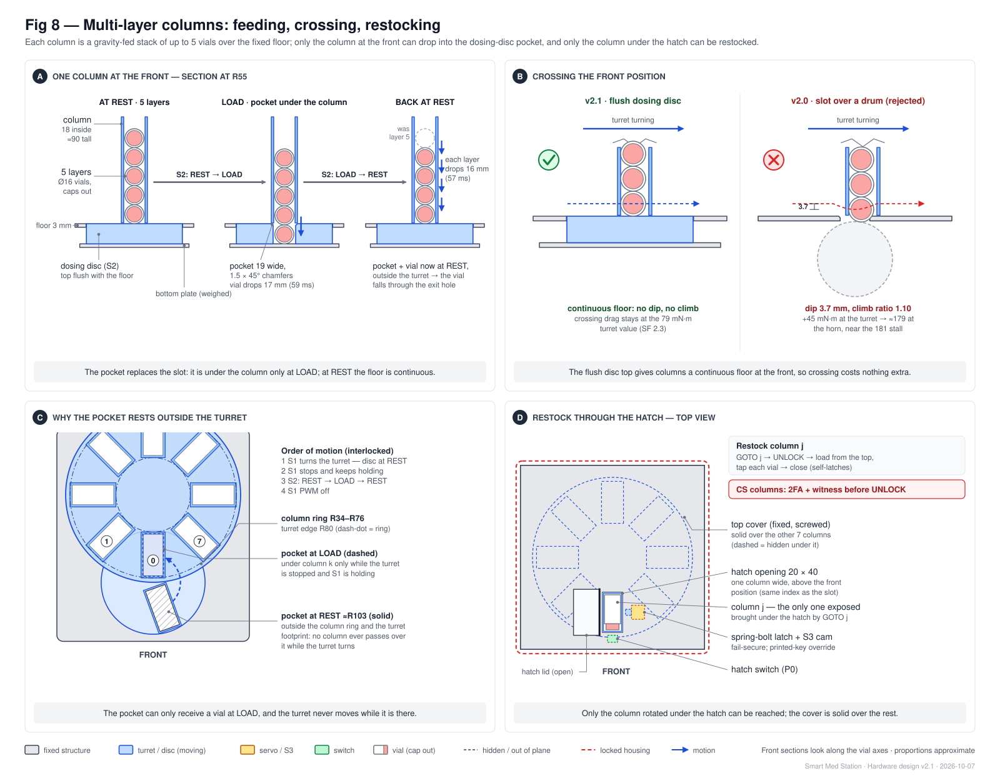

- **Feeding:** after each dispense, the column's next layer drops down by gravity.
- **Crossing:** while the turret turns, the other columns' bottom vials slide over the disc's flush top, so there is nothing to dip into. (The v2.0 slot made vials dip 3.7 mm and nearly stalled S1.) The pocket only moves under a column while the turret is stopped.
- **Restock:**
  1. The host turns column *j* under the hatch and unlocks it.
  2. The restocker taps each vial and drops it in. The host records each mass step.
  3. The hatch self-latches on close.
- **Power-loss access:** the key opens the hatch, and the unpowered turret can be turned by hand (about 1 N at a column wall) to reach any drug.

### 4.7 Load cell

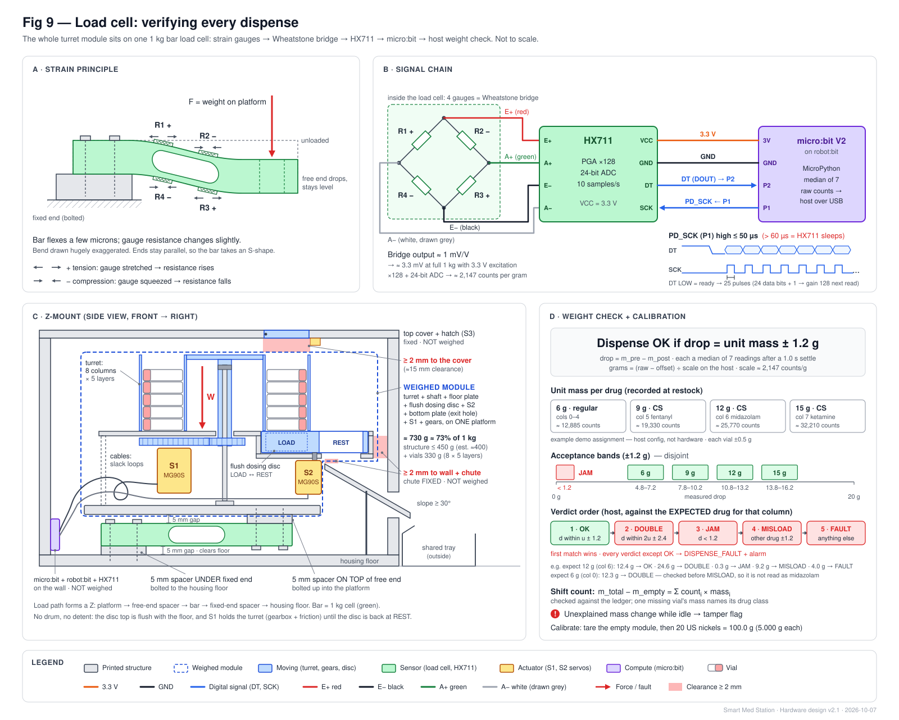

**How it works:** strain gauges on an aluminum bar form a Wheatstone bridge that outputs about 1 mV/V. The HX711 (24-bit, ×128 gain, 10 samples/s) digitizes the signal over two wires (P1 clock, P2 data).

**Calibration:** tare the empty module, then load 20 US nickels (100.0 g).

**Scale and resolution:** about 2,147 counts/g (1 mV/V, 3.3 V, gain 128). Practical resolution is expected at 0.1–0.5 g, well inside the ±1.2 g acceptance band.

### 4.8 Shared tray and RFID tap pad

- **Tray:** about 60 × 40 × 25 mm, with an anti-reach flap so nobody can reach up the chute.
- **Reader:** the RC522 sits behind the 2 mm front wall in a "TAP HERE" recess right beside the tray.
- **Tags:** badges are the kit's MIFARE card and fob (4-byte UIDs). Vials carry NTAG213 stickers (7-byte UIDs).

---

## 5. Operating sequences

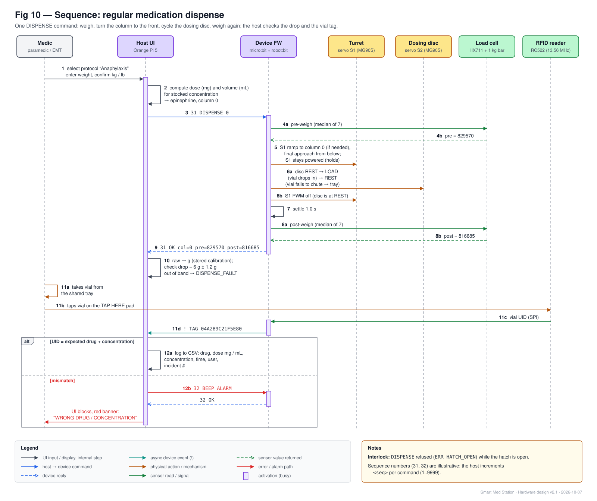

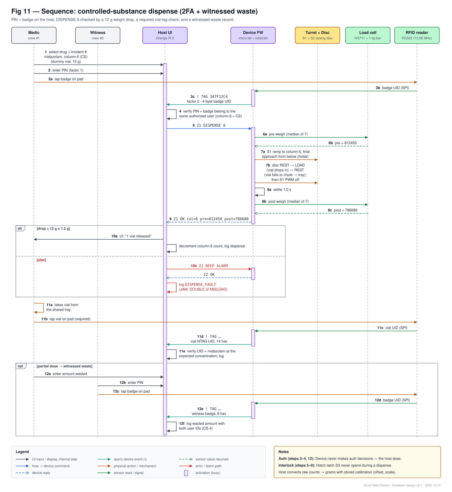

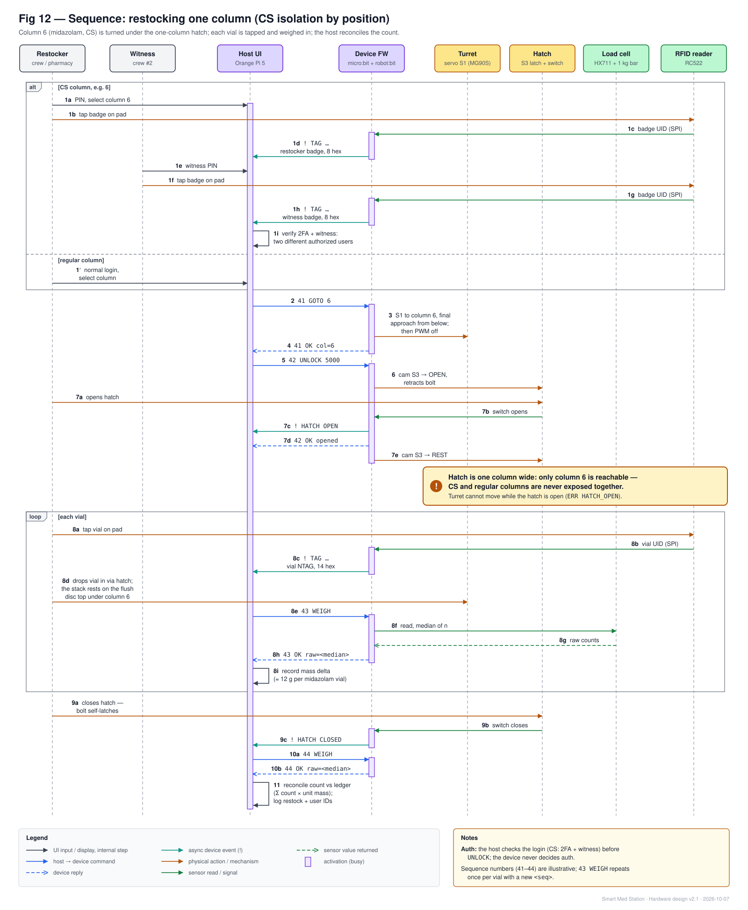

**Override and power loss**
- The hatch stays locked whenever power is lost, and the key always works.
- When power returns, the device sends `! BOOT` and the host logs the outage (detected by a gap in the 1 Hz heartbeat).
- Any key use shows up as `! FORCED`.

**Device state machine:** see [technical-doc §7](technical-doc.md#7-device-firmware-specification) (Fig 15).

---

## 6. Safety behavior and failure modes

**Guiding rule (SAF-2): the device must never block access to drugs.** Electrical failures leave the hatch locked, and the mechanical key plus a hand-turnable turret are always the fallback. Every key use is logged.

| Failure | Effect | Detection | Response |
|---|---|---|---|
| Power loss | Motion stops; hatch locked; disc at REST | Host: heartbeat gap / unexpected `! BOOT` | Key + hand-turn; log `POWER_LOSS` |
| Host crash or USB unplugged | Device idle | Device: 10 s silence → SAFE | Reconnect or swap to laptop |
| Servo brown-out | micro:bit resets | `! BOOT` | One-servo rule; separate servo supply |
| Floor too sticky | Turret stalls or slows | Move takes too long; dispense times out | Re-wax the floor; tilt test (T0); trim to 4 layers |
| Turret off-center | Vial can't drop cleanly | Weight drop ≈ 0 (JAM) | Recalibrate the column; confirm the one-direction approach |
| Power lost mid-dispense (disc at LOAD) | Vial left in the pocket | `! BOOT`; the disc is driven to REST at boot, releasing it | Host logs a recovered dispense for the last commanded column |
| Hatch left open | No motion allowed | Hatch switch | `GOTO`/`DISPENSE` → `ERR HATCH_OPEN` |
| Hatch keyed or forced | Access without auth | `! FORCED` | Log **OVERRIDE**, flag for review |
| Wrong vial loaded in a column | Wrong drug dispensed | Mass ≠ expected (MISLOAD) and/or tag mismatch | UI blocks; `BEEP ALARM`; log |
| Dispense jam / double | 0 or 2 vials out | Mass drop ≈ 0 / ≈ 2 units | `DISPENSE_FAULT`; clear via hatch (2FA + witness for CS) |
| Tamper on the tower | (none) | `! SHOCK`; unexplained mass change | Log + alarm |
| Hatch switch wire break | Reads OPEN | Hatch stuck at OPEN | Fail-safe: motion refused; repair |
| HX711 glitch | Bad reading | Saturated or outlier sample rejected; median filter | Retry; `! FAULT HX711` after repeats |
| RFID failure | Can't verify | `! FAULT RFID` | Host offers logged manual verification (never blocks care) |

---

## 7. Requirements traceability

✔ = met by the prototype hardware · ◐ = partial / demo-grade · — = software-only or out of scope

| Req (handoff §6) | How the hardware addresses it | Status |
|---|---|---|
| FR-1 indexed slots (8–12) | 8 columns (SKUs) × 5 layers = 40 units | ✔ |
| FR-2 present within TBD s | Dispense about 3.2 s (column in front), ≤ 5 s worst case | ✔ |
| FR-3/FR-4 dose calc, mg + mL | Host software + display | — |
| FR-5 barcode verification | **Deviation:** RFID tap of every dispensed vial (D7) | ✔ |
| FR-6 log every access | Device emits dispense, hatch, forced, tag and shock events; host logs | ✔ |
| FR-7 lot/expiry per slot | Restock records tag → lot/expiry per column | ✔ |
| CS-1 separate locked compartment | Whole tower is the locked safe (printed; steel and permanent mount = product) | ◐ |
| CS-2 two-factor auth | PIN + RFID badge | ✔ |
| CS-3 single-unit release | One-pocket dosing disc + per-drug weight-drop check | ✔ |
| CS-4 witnessed waste | Second PIN + badge (host flow) | ✔ |
| CS-5 automatic count | Total-mass reconciliation + verified dispense log | ✔ |
| CS-6 jump-bag check-out/in | Supported by tags; host feature is a stretch goal | — |
| CS-7 override with audit trail | Key override + `FORCED` event | ✔ |
| ENV-1 vibration/shock | Out of scope; shock *detection* only | ◐ |
| ENV-2 mechanical lock when idle | Servo gearbox + stack friction hold the turret (the detent failed the physics); positive lock = product path | ◐ |
| ENV-3 12 V + battery | 5 V supplies; 18650 servo backup; 12 V = product path | ◐ |
| ENV-4 temperature logging | micro:bit temperature in `! HB` | ✔ |
| ENV-5 mounting envelope | CAD (team) | — |
| SAF-1 weight entry | Host UI | — |
| SAF-2 never block access | Fail-secure hatch + key + hand-turnable turret | ✔ |
| SAF-3 gloves / low light | One tray, large tap pad; UI contrast (software) | ◐ |

---

## 8. Risks and mitigations

| # | Risk | Likelihood | Mitigation / early test |
|---|---|---|---|
| R1 | **Floor friction too high** (µ > 0.2), so S1 stalls or slows | Med | **Tilt test in week 1 (T0):** a vial must slide at ≤ 11°. Print the floor face-down on glass/PEI, then apply paraffin wax or PTFE dry lube; trim to 4 layers if needed. |
| R2 | Dosing-disc rim gap or flushness off, so vials catch while crossing | Low–Med | Print the disc and its recess as a matched pair; 0.3 mm gap, flush ±0.2 mm; crossing coupon (T0) |
| R3 | Weighed module too heavy | Med | Printed structure ≤ 450 g (weigh the parts before loading vials); total ≈ 730 g. Last resort: the 5 kg cell kit ($7.99, coarser resolution). |
| R4 | HX711 timing in MicroPython | Med | Display off, saturation/outlier rejection, median filter; if the error rate is > 5% in T8, port the firmware to MakeCode |
| R5 | Servo travel < 160° | Med | Measure in T3 before printing gears; fallback to 7 columns or a 2.25:1 ratio |
| R6 | Servo positioning drifts with stock level (load changes) | Low | One-direction approach; calibrate with a half-full stock; ±3.0 mm capture vs ±1.7 mm error |
| R7 | robot:bit power connector / 5–6 V limit unconfirmed | Med | Inspect on day 1; fall back to the 18650 |
| R8 | RC522 can't read through the wall | Low | 1.5 mm wall at the pad; test coupon (T7) |
| R9 | Uniform cartridge assumption: real syringes and blister cards won't fit | Certain (product) | Prototype uses standard dummy vials; product path = per-package-family columns or pharmacy-loaded cartridges |
| R10 | Board is a micro:bit V1 | Low | Check the gold logo/speaker; V1 → MakeCode |
| R11 | Load-cell creep or off-center error on a tall module | Low | Compare pre/post within seconds; recalibrate per shift; ±1.2 g bands leave margin |

---

## 9. Prototype vs product

| Aspect | Prototype (this build) | Product path |
|---|---|---|
| Storage | One printed tower, regular + controlled columns together | Steel tower bolted to the frame; optional physically separate CS ring with its own hatch + dosing disc |
| Packages | Uniform Ø16 × 35 dummy vials | Per-package-family columns and discs, or standardized pharmacy-loaded cartridges |
| Drive / lock | MG90S + printed 2:1 gears; held by the servo + friction | Stepper/BLDC + absolute encoder; positive brake |
| Verification | 13.56 MHz NTAG + weight | DataMatrix imager + optional UHF RFID + per-column load cells |
| Power | 5 V adapters + 18650 backup | 12 V vehicle → buck converter + UPS |
| Command security | Plain-text USB serial | Authenticated (HMAC) commands |

---

## 10. Changes from v1

| Removed | Added |
|---|---|
| Separate pick-through carousel (window, door, door latch, door switch) | One unified turret: 8 columns × 5 layers |
| Lock-pin servo | Servo positioning with a one-direction approach (no detent) |
| Separate single-drug CS box with its own tray | Flush dosing disc at one fixed front position |
| | One-column restock hatch (the v1 latch design, reused) |
| | One shared tray beside the tap pad |
| | Per-drug vial masses; `DISPENSE <k>` |

**Net:** servos **5 → 3** (all MG90S), modules 2 → 1, GPIO 8 → 7 used, and the HX711 clock moved off the uncertain P12.

**v2.1 physics pass (same day):**
- The drop slot + drum became the flush dosing disc (the slot crossing nearly stalled S1).
- The detent was removed (it could not work against the stack drag).
- Vial masses dropped from 8/11/14/17 g to 6/9/12/15 g.
- The floor friction target is now µ ≤ 0.2.
- Settle time dropped from 1.5 to 1.0 s.
- All servos are MG90S.
- The calculations are in [technical-doc §13](technical-doc.md#13-engineering-calculations).

## 11. Open items to verify when parts arrive

- [ ] micro:bit is V2 (notched edge connector, gold logo, speaker).
- [ ] robot:bit version and external-power connector; header **V** pin reads **3.3 V**.
- [ ] Three MG90S on hand; real travel of S1 and S2 (T3).
- [ ] Floor tilt test: a vial slides at ≤ 11° (µ ≤ 0.2).
- [ ] Load-cell thread size (M4/M5) and wire colors.
- [ ] RC522 range through the printed wall (T7).
- [ ] 608 bearing availability; paraffin wax or PTFE dry lube for the floor.

## 12. Sources

- KittenBot robot:bit extension: https://github.com/KittenBot/pxt-robotbit · hardware docs: https://kittenbot-docs-en.readthedocs.io/en/latest/mainboards/01Robotbit.html
- micro:bit edge connector: https://tech.microbit.org/hardware/edgeconnector/ · power: https://tech.microbit.org/hardware/powersupply/
- micro:bit MicroPython V2: https://microbit-micropython.readthedocs.io/en/v2-docs/spi.html
- MFRC522 datasheet: https://www.nxp.com/docs/en/data-sheet/MFRC522.pdf · NTAG213: https://www.nxp.com/docs/en/data-sheet/NTAG213_215_216.pdf
- HX711 datasheet: https://cdn.sparkfun.com/datasheets/Sensors/ForceFlex/hx711_english.pdf
- FDA DSCSA product identifier guidance: https://www.fda.gov/media/116304/download
- Fresenius Kabi +RFID / Kit Check update: https://www.plusrfid.com/an-important-update-for-rfid-customers-using-bluesights-kitcheck-system/
- Vial dimensions: https://bigcomm.ktecdirect.com/specs/DWK_injection_vial_dimension_guide_spec.pdf
- Concept, requirements, DEA rule summary: [`proj3handoff.md`](../../proj3handoff.md)
