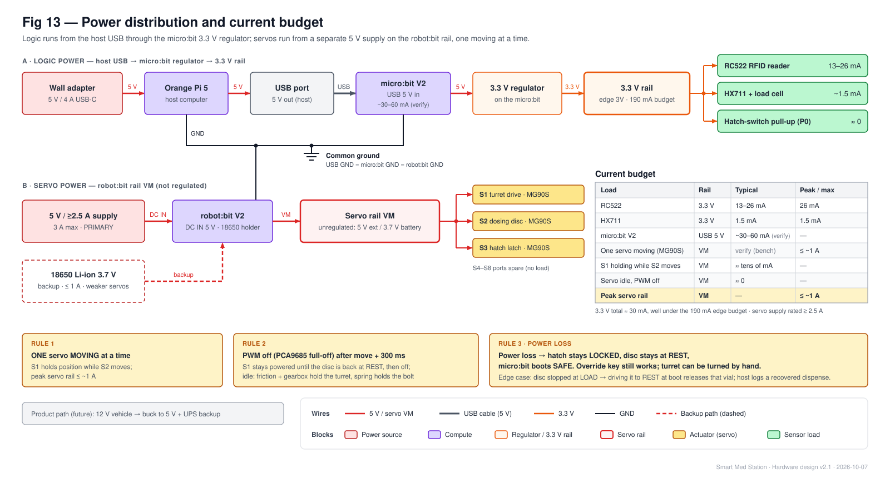
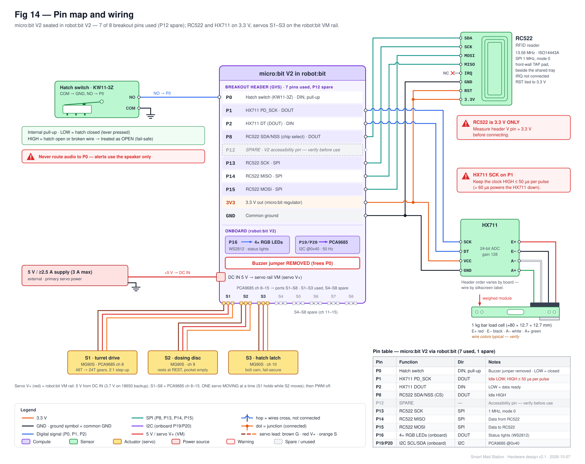
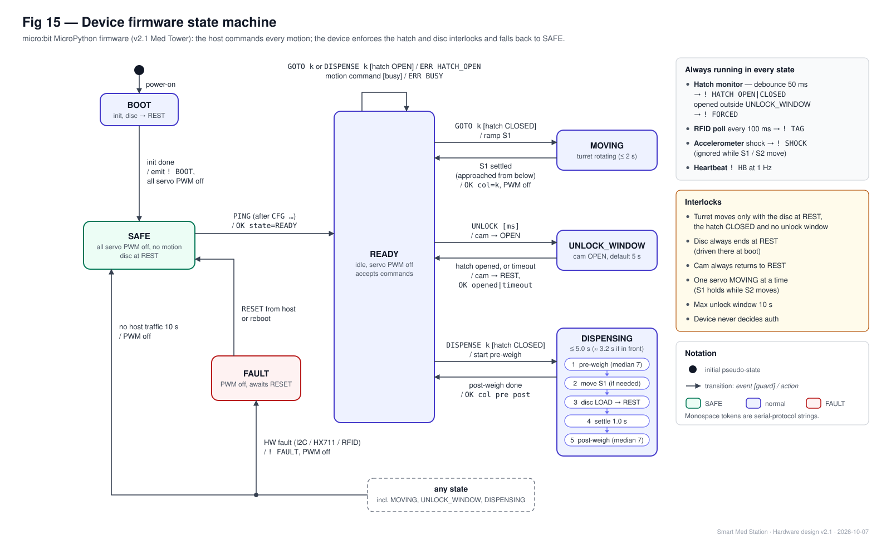
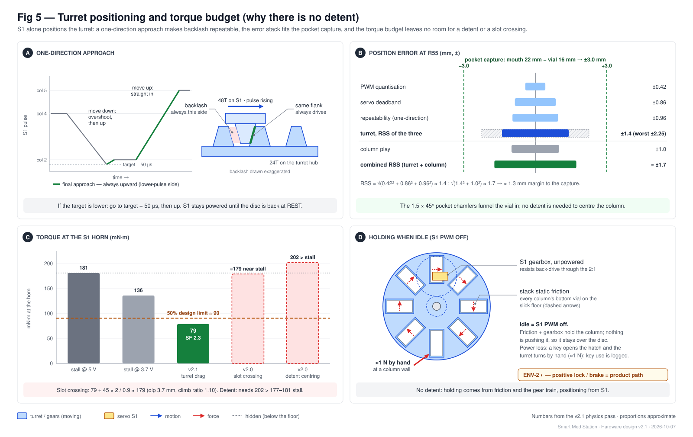

# Smart Med Station — Hardware Technical Reference

| | |
|---|---|
| **Version** | v2.1 "Med Tower", physics-checked (2026-10-07) |
| **Companion doc** | [design-doc.md](design-doc.md) (what and why) |
| **Audience** | The builder and coding agents. Every table here is meant to be implementable without guessing. |

**Conventions**
- micro:bit pins are written `P<n>`.
- robot:bit servo ports are `S1–S8`, which map to PCA9685 channels 8–15.
- All logic is 3.3 V.
- "Column *k*" means turret column *k* (0–7); a column is "selected" when it sits at the front, over the dosing disc's LOAD position and under the hatch.
- "Start value" means a default that is replaced by bench calibration.

---

## 1. Bill of materials

### 1.1 Purchase (budget $30)

Prices are from Amazon listings seen in October 2026; verify before ordering.

| # | Item | Qty | Unit $ | Total $ | Link |
|---|---|---|---|---|---|
| B1 | RC522 RFID kit (reader + MIFARE card + key fob) | 1 | 5.69 | 5.69 | https://www.amazon.com/dp/B01CSTW0IA |
| B2 | NTAG213 sticker tags, 10-pack | 3 | 3.12 | 9.36 | https://www.amazon.com/dp/B0BB5Q69P9 |
| B3 | HX711 + 1 kg bar load cell kit | 1 | 6.69 | 6.69 | https://www.amazon.com/dp/B07CN5NM86 |
| B4 | KW11-3Z hinge-lever microswitch, 10-pack | 1 | 6.99 | 6.99 | https://www.amazon.com/dp/B07P25F2DL |
| | **Total** | | | **28.73** | $1.27 contingency |

- The design needs only **one** microswitch (the hatch). If the lab has one, skip B4: the total drops to $21.74.
- That saving can fund an extra MG90S if you have fewer than 3.

### 1.2 On hand / free

| Item | Qty | Notes |
|---|---|---|
| Orange Pi 5 + 5 V/4 A USB-C adapter | 1 | Host |
| HDMI display + cable, USB keyboard/mouse | 1 | Host UI |
| Laptop | 1 | Development + fallback host |
| BBC micro:bit **V2** + micro-USB data cable | 1 | Device MCU |
| KittenBot robot:bit (V2.x) | 1 | PCA9685 servo driver, GPIO breakout |
| **3 × MG90S** servos (turret, dosing disc, hatch latch) | 3 | The team has only MG90S; any other servo comes out of the budget |
| 5 V supply, ≥ 2.5 A (≤ 3 A), plus a lead to the robot:bit DC input | 1 | Servo rail. Check the connector type on your board. |
| 18650 Li-ion cell | 0–1 | Optional servo-rail backup (slower turret, 1.7× margin) |
| M8 bolt + nuts (turret shaft), 608 bearing (or printed bushing), M3/M4 screws | — | Load-cell threads are M4 or M5 (verify) |
| Paraffin wax (a candle) or PTFE dry lube | — | Floor friction µ ≤ 0.2 (tilt test T0) |
| Pen spring (Ø5–6 × 10–15 mm, ≈ 0.15 N/mm) | 1 | Hatch latch bolt |
| M6 steel nuts (≈ 2.5 g) + washers; 20 US nickels | — | Vial ballast; nickels = 100.0 g calibration mass |
| Dupont jumpers, ribbon cable ≤ 25 cm, PLA/PETG | — | |

### 1.3 Dummy vials and tags (Ø16 × 35 mm, printed, M6-nut ballast)

| Column (example config) | Drug | Class | Vial mass | Vials | Tagged |
|---|---|---|---|---|---|
| 0–4 | e.g., epinephrine, naloxone, ondansetron, diphenhydramine, dexamethasone | Regular | 6 g ± 0.5 | 5 each | 3 each (15) |
| 5 | Fentanyl (dummy) | CS | 9 g ± 0.5 | 5 | 5 |
| 6 | Midazolam (dummy) | CS | 12 g ± 0.5 | 5 | 5 |
| 7 | Ketamine (dummy) | CS | 15 g ± 0.5 | 5 | 5 |

- **Badges:** the kit's MIFARE card (crew member 1) and fob (crew member 2 / witness).
- **Assigning drugs to columns** is host configuration, not hardware.

---

## 2. Power



| Rail | Source | Feeds | Budget |
|---|---|---|---|
| Host 5 V | Orange Pi 5 USB-C adapter (5 V/4 A) | Orange Pi 5, then its USB port to the micro:bit | Adapter-limited |
| micro:bit 3.3 V | micro:bit regulator (from USB) | micro:bit, RC522 (13–26 mA), HX711 (~1.5 mA), hatch-switch pull-up | 190 mA edge budget; we use ~30 mA |
| Servo VM | 5 V ≥ 2.5 A supply → robot:bit DC IN (**primary**); 18650 = backup | S1–S3 | Peak ≤ ~1 A; ≈ 0 when PWM off |

**Rules for firmware and wiring**
1. **One servo moving at a time.** S1 holds the turret (powered) while S2 runs the disc. When the cycle ends, wait 300 ms, then set every channel to full-off.
2. The servo rail is **unregulated**: about 5 V on the external input, about 3.7 V on the battery. Torque drops about 25% on battery, so recalibrate if you change the supply.
3. Common ground: USB GND = micro:bit GND = robot:bit GND. Never power the RC522 from the servo rail.
4. On power loss, the hatch stays locked by its spring, the disc stays at REST, and the micro:bit boots to **SAFE** (no motion).

---

## 3. Pin map



| Pin | Function | Dir | Electrical | Notes |
|---|---|---|---|---|
| **P0** | Hatch switch | In | Internal pull-up; switch to GND | **Remove the robot:bit buzzer jumper first.** LOW = closed; HIGH = open **or broken wire** (fail-safe). Never route audio to P0. |
| **P1** | HX711 PD_SCK | Out | Idle LOW | HIGH ≤ 50 µs per pulse (> 60 µs powers the HX711 down) |
| **P2** | HX711 DOUT | In | 3.3 V logic | LOW = conversion ready |
| **P8** | RC522 SDA/NSS (chip select) | Out | Idle HIGH | Active LOW during SPI transfers |
| P12 | **Spare** | — | — | V2 "accessibility" pin; bench-verify before using |
| **P13 / P14 / P15** | RC522 SCK / MISO / MOSI | SPI | 1 MHz, mode 0 | |
| P16 | robot:bit 4 × RGB LEDs | Out | onboard | Status colors |
| P19/P20 | I2C SCL/SDA → PCA9685 @ 0x40 | I2C | onboard | 400 kHz OK |
| (internal) | Accelerometer, temperature, speaker | — | onboard | V2 motion sensor is on a separate internal I2C bus |

---

## 4. Wiring by device

### 4.1 RC522 RFID reader (3.3 V ONLY)

| RC522 pin | SDA | SCK | MOSI | MISO | IRQ | GND | RST | 3.3V |
|---|---|---|---|---|---|---|---|---|
| **Connect to** | P8 | P13 | P15 | P14 | (not connected) | GND | 3.3 V | 3.3 V |

**Before connecting:** measure the robot:bit header V pin. It must read 3.3 V ± 0.1 V. If it reads 5 V, take 3.3 V from the micro:bit 3V pad instead.

### 4.2 HX711 + load cell

| HX711 pin | VCC (+VDD) | GND | DT | SCK | E+ / E− | A+ / A− |
|---|---|---|---|---|---|---|
| **Connect to** | 3.3 V | GND | **P2** | **P1** | Cell red / black | Cell green / white |

- The load-cell wire colors are typical; verify them on your cell. If readings go negative under load, swap A+ and A−.
- Leave the HX711 RATE pin at its default (10 samples/s).
- The leads cross the weighed/fixed boundary, so give them a slack loop.

### 4.3 Hatch switch (KW11-3Z)

COM → GND, NO → **P0**. The closed hatch presses the lever → LOW. Mount the switch so the closed hatch pushes the lever about 1 mm past the click point.

### 4.4 Servos (all MG90S)

Servo wire colors: brown = GND, red = V+, orange = signal.

| Port | PCA9685 ch | Job | Location |
|---|---|---|---|
| S1 | 8 | Turret drive (48T gear, 2:1) | Weighed module, under the floor, rear |
| S2 | 9 | Dosing disc (vertical axis, directly under the disc) | Weighed module, front |
| S3 | 10 | Hatch latch cam | Top cover (fixed) |
| S4–S8 | 11–15 | Spare | |

S1 and S2 ride on the weighed module, so give their cables slack loops to the fixed robot:bit.

---

## 5. Servo control and calibration data

**PCA9685 (address 0x40)**
- **Setup:** `MODE1 = 0x10` (sleep) → `PRE_SCALE (0xFE) = 121` (50 Hz) → `MODE1 = 0x20` (wake, auto-increment) → wait 5 ms.
- **Pulse:** `ticks = round(us × 4096 / 20000)` (1 tick = 4.88 µs). Write `LEDn_ON_L = 0x06 + 4·n` with ON = 0, OFF = ticks.
- **Full-off:** write `0x10` to `LEDn_OFF_H` (`0x09 + 4·n`).
- Clamp every pulse to 500–2500 µs.

**Named positions** (start values; calibrated values are stored on the host and pushed with `CFG`)

| CFG key | Servo | Start µs | Meaning |
|---|---|---|---|
| `col0` … `col7` | S1 | 625 + 250·k | Column k at the front (servo angle 11.25° + 22.5°·k) |
| `disc_rest` | S2 | 600 | **Rest:** pocket outside the turret, over the exit hole |
| `disc_load` | S2 | 2380 | Pocket under the front column (≈ 160° from REST) |
| `cam_rest` / `cam_open` | S3 | 1000 / 1900 | Hatch cam clear / bolt retracted |

**Movement rules**
- **S1 ramp:** ≤ 25 µs (about 2°) per 20 ms, about 1.4 s for a full sweep.
- **S1 one-direction approach:** always finish on the target from the lower-pulse side. If the target is below the current pulse, go to target − 50 µs first, then step up to the target.
- **S2 and S3** move directly.
- **Holding:** S1 stays powered until the disc is back at REST. Then wait 300 ms and set the channels to full-off.

**2:1 gear reference:** turret angle = 2 × servo angle. With module 1.25, the 48T gear has a 60 mm pitch diameter and the 24T gear 30 mm; center distance is 45 mm.

---

## 6. Mechanical interface summary (for CAD)

The CAD lead owns geometry. These are the numbers the electronics, firmware and physics assume. Measure every purchased part with calipers before modeling.

| Item | Value the design assumes |
|---|---|
| Turret | 8 columns @ 45°, centers on R55; internal 18 (tangential) × 38 (radial), walls 1.2–2 mm, ≈ 90 tall (5 layers); Ø ≈ 160; hub on a fixed M8 shaft with a 608 bearing; 24T hub gear below the floor |
| Floor plate | Fixed, 3 mm; top **µ ≤ 0.2** (printed face-down on glass/PEI + wax or PTFE lube); center hole for the hub; front recess for the dosing disc |
| Dosing disc | Ø95 × 17. Top **flush** with the floor (±0.2 mm), 0.3 mm radial gap; vertical axis at R80 on the front line, S2 directly below. One through-pocket 19 × 39 centered 25 mm from the axis, with 1.5 × 45° top chamfers (mouth 22 × 42). LOAD under the front column (R55); REST ≈ 160° away, outside the turret (≈ R103), over the exit hole. |
| Bottom plate | Under the disc (weighed); supports the pocketed vial; exit hole ≈ 22 × 42 at REST |
| Gears | 48T (S1) : 24T (hub), module 1.25, 20° pressure angle, 6 mm face, center distance 45; S1 at the rear under the floor |
| Exit + tray | Fixed chute ≥ 30° from the exit hole (not weighed, ≥ 2 mm gap) → shared tray ≈ 60 × 40 × 25 at the front. The medic lifts a flap; the flap is never in the vial's path. |
| RFID pad | RC522 ≈ 40 × 60 behind a ≤ 2 mm front wall beside the tray |
| Hatch | Top cover above the front column; opening 20 × 40; bolt 6 × 6, 8 mm throw, 45° bevel; pen spring; cam arm ≈ 12; KW11-3Z switch; key hole aimed at the bolt |
| Load cell | ≈ 80 × 12.7 × 12.7 bar; Z-mount with 5 mm spacers; platform carries the whole weighed module; ≥ 2 mm clearance; printed weighed structure **≤ 450 g** |
| Housing | ≈ 200 internal height; footprint ≈ 180 W × 230 D (disc edge ≈ R127) plus wall space for the electronics |
| Purchased envelopes (verify) | MG90S ≈ 22.8 × 12.2 × 28.5 · KW11-3Z ≈ 20 × 10 × 6.4 · micro:bit + robot:bit: measure |

---

## 7. Device firmware specification

**Platform:** MicroPython for micro:bit V2. Flash with the micro:bit Python Editor or `uflash`/`microfs`.

**Platform constraints**
- There are no `machine.Pin`, `machine.SPI` or `json` modules. Use `microbit.pinN`, `microbit.spi`, `microbit.i2c` and string parsing.
- Call `display.off()` at boot.
- Serial uses `uart.init(115200)` on the default USB pins.



### 7.1 States

| State | Entered when | Allowed commands | Exit |
|---|---|---|---|
| BOOT | Power-on | (none) | Drive the disc to REST, all PWM off, `! BOOT` → SAFE |
| SAFE | After boot, host silence ≥ 10 s, or `RESET` | `PING`, `CFG`, `STATUS`, `WEIGH`, `SERVO`, `BEEP`, `LED` | `PING` → READY |
| READY | Host connected | All | `GOTO` / `DISPENSE` / `UNLOCK` → the matching busy state |
| MOVING | `GOTO k` accepted | `PING`, `STATUS` (others → `ERR BUSY`) | S1 settled → `OK col=k` → READY |
| DISPENSING | `DISPENSE k` accepted | `PING`, `STATUS` | Post-weigh done → `OK col= pre= post=` → READY |
| UNLOCK_WINDOW | `UNLOCK` accepted | `PING`, `STATUS` | Hatch opened, or timeout → cam to REST → READY |
| FAULT | I2C, HX711 or RFID hardware fault | `PING`, `STATUS`, `RESET` | `RESET` → SAFE |

### 7.2 Interlocks (enforced in firmware, not just in the host)

1. **The turret never moves** unless the disc is at REST, the hatch is CLOSED, and no unlock window is active. Otherwise `ERR HATCH_OPEN` or `ERR BUSY`.
2. **The disc always ends at REST,** even on error. At boot it is driven to REST. If a power loss left a vial in the pocket, this releases it, and the host logs a recovered dispense.
3. **The cam always returns to REST** after every unlock window. Default window 5000 ms, max 10000 ms.
4. **One servo moving at a time** (S1 may hold while S2 moves).
5. **The firmware never decides authorization**; the host does.

### 7.3 Main loop (cooperative, no blocking > 20 ms)

Every iteration:
- Parse at most one serial line.
- Sample P0. Debounce: a hatch state change is accepted after 50 ms stable.
- Advance the active motion step function.

Periodic tasks:
- **Every 100 ms:** poll the RC522.
- **Every 100 ms:** if DOUT is LOW, read the HX711 and cache the raw value.
- **Every loop:** read the accelerometer.
- **Every 1000 ms:** emit `! HB`.

### 7.4 Sequences inside the device

| Command | Steps |
|---|---|
| `GOTO k` | 1. Check the interlocks. 2. Ramp S1 toward `col{k}`, finishing from the lower-pulse side. 3. Wait 300 ms. 4. S1 off. 5. Reply `OK col=k`. |
| `DISPENSE k` | 1. Check the interlocks. 2. `pre` = median of 7 HX711 reads (≈ 0.7 s). 3. If needed, run GOTO steps 2–3; **S1 keeps holding**. 4. S2 → `disc_load`, wait 400 ms (the vial drops in). 5. S2 → `disc_rest`, wait 400 ms (the vial falls out). 6. Wait 300 ms, then S1 and S2 off. 7. Settle 1.0 s. 8. `post` = median of 7. 9. Reply `OK col=k pre=<raw> post=<raw>`. **Total ≈ 3.2 s with the column in front, ≤ 5.0 s worst case.** |
| `UNLOCK [ms]` | S3 → `cam_open`; poll P0. On OPEN (debounced) or timeout: S3 → `cam_rest`, wait 300 ms, S3 off; reply `OK opened` or `OK timeout`. |

### 7.5 Driver notes

**Hatch events:** on a debounced CLOSED → OPEN, emit `! HATCH OPEN`, plus `! FORCED` if no unlock window was active. On OPEN → CLOSED, emit `! HATCH CLOSED`.

**HX711 (P1 clock, P2 data):**
1. Wait for DOUT LOW (timeout 200 ms).
2. Clock 24 bits MSB-first: P1 HIGH, P1 LOW, read P2.
3. Send one extra pulse (channel A, gain 128).
4. Sign-extend the value.
5. Discard 0x7FFFFF and 0x800000 (saturated).
6. After 5 consecutive failures, emit `! FAULT HX711`.

**RC522:**
- Use `spi.init(baudrate=1000000, bits=8, mode=0, sclk=pin13, mosi=pin15, miso=pin14)`. CS is P8.
- Register address byte: write `(reg<<1)&0x7E`, read `|0x80`.
- Port `wendlers/micropython-mfrc522`.
- Implement cascade level 1 (SEL 0x93) and, if the first UID byte is `0x88`, level 2 (SEL 0x95). The result is a 4-byte UID (badges) or a 7-byte UID (NTAG213).
- Emit `! TAG <hex>`. Suppress the same UID for 1.5 s.

**Shock:**
- Call `accelerometer.set_range(8)` (or use gestures `'3g'`/`'6g'`).
- If | |a| − 1000 mg | > `shock_mg` (default 1500), emit `! SHOCK`, at most 1/s.
- Ignore readings while S1 or S2 moves.

**Audio and temperature:** use the speaker with `pin=None` in `music` calls (never P0). `temperature()` goes into each `! HB`.

---

## 8. Serial protocol

**Transport:** USB CDC serial, 115200 8N1, ASCII lines ending in `\n`, ≤ 64 characters each.
- Orange Pi: `/dev/ttyACM0`; add the user to the `dialout` group.
- macOS: `/dev/tty.usbmodem*`. Windows: `COMx`.

**Message forms**

| Direction | Form |
|---|---|
| Host → device | `<seq> <CMD> [args]` (seq 1–9999, echoed in the reply) |
| Device → host, reply | `<seq> OK [k=v …]` or `<seq> ERR <CODE> [k=v …]` |
| Device → host, event | `! <EVENT> [k=v …]` (unsolicited, may appear between any lines) |

| Command | Reply | Host timeout | Notes |
|---|---|---|---|
| `PING` | `OK fw=<ver> state=<STATE>` | 1 s | Moves SAFE → READY. Host must send traffic at least every 2 s (watchdog). |
| `CFG <key> <value>` | `OK` | 1 s | Keys from §5, plus `shock_mg`. Out-of-range → `ERR BAD_ARG`. |
| `STATUS` | `OK col=<0-7\|?> hatch=<OPEN\|CLOSED> disc=<REST\|?> raw=<counts> temp=<C> state=<STATE>` | 1 s | Allowed in any state |
| `GOTO <0-7>` | `OK col=<k>` | 4 s | Positioning and restock. `ERR HATCH_OPEN`, `ERR BUSY`, `ERR BAD_ARG`, `ERR NOT_READY` |
| `DISPENSE <0-7>` | `OK col=<k> pre=<raw> post=<raw>` | 7 s | Host converts to grams and judges (§10.4) |
| `UNLOCK [ms]` | `OK opened` \| `OK timeout` | ms + 1 s | Hatch. Default 5000, max 10000. |
| `WEIGH [n]` | `OK raw=<median>` | 2 s | n = samples (default 5, max 15) |
| `SERVO <1-8> <us\|OFF>` | `OK` | 1 s | Calibration and service only. Host should gate it behind an admin login. |
| `BEEP <OK\|ERR\|ALARM>`, `LED <IDLE\|BUSY\|OK\|ERR\|ALARM>` | `OK` | 1 s | Speaker; robot:bit RGB |
| `RESET` | `OK` | 1 s | FAULT → SAFE |

**Events:**
- `! BOOT fw=<ver>`
- `! HB t=<ms> raw=<counts> temp=<C> hatch=<C|O> state=<STATE>` every 1 s; the host flags link loss after 3 s of silence.
- `! HATCH <OPEN|CLOSED>`
- `! FORCED`: hatch opened outside an unlock window.
- `! TAG <hex>`: 8 hex characters = badge, 14 = NTAG vial.
- `! SHOCK mg=<peak>`
- `! FAULT <HX711|RFID|I2C>`

**Error codes:** `HATCH_OPEN`, `BUSY`, `BAD_ARG`, `BAD_CMD`, `NOT_READY`, `HW_FAULT`.

**Example session**

```
> 1 PING                 < 1 OK fw=0.2 state=READY
> 2 CFG col6 1880        < 2 OK
> 3 DISPENSE 6           < ! HB t=81234 raw=812450 temp=24 hatch=C state=DISPENSING
                         < 3 OK col=6 pre=812450 post=786680
                         < ! TAG 04A2B9C21F5E80
```

A drop of 25,770 counts at about 2,147 counts/g is 12.0 g. That matches midazolam's 12 g ± 1.2, so the host checks the tag and logs the dispense.

---

## 9. Bring-up and test procedures

Run the tests in order; T0 runs in week 1, before final CAD.

| ID | Test | Procedure | Pass criteria |
|---|---|---|---|
| **T0** | **Floor friction + crossing coupon** | (a) Put a vial on a floor coupon and tilt it until the vial slides. (b) Print a 3-column turret segment, a floor coupon and a flush disc insert (0.3 mm gap); drag weighted columns across the disc 50 times. | (a) Slides at **≤ 11°** (µ ≤ 0.2); otherwise add wax or PTFE lube. (b) Zero catches. |
| T1 | Power | Measure the header V pin and the DC IN rail; check the micro:bit version | Header V = 3.3 ± 0.1 V; VM ≈ 5 V; board is V2 |
| T2 | Pins + I2C | I2C scan; toggle P1/P8; read P0/P2 with a jumper | 0x40 found; all used pins behave as GPIO |
| T3 | Servo range | Sweep `SERVO 1` and `SERVO 2` 500 → 2500 µs; measure with a printed protractor | S1 ≥ 165° (157.5° needed); S2 ≥ 165° (160° needed) |
| T4 | Turret positioning | Calibrate `col0–7` with a half-full stock; 20 random `GOTO`s with a full stock | Each column within ±1.5 mm of LOAD, 20/20; ≤ 2 s; no stalls |
| T5 | Hatch switch | 20 open/close cycles | Exactly one OPEN and one CLOSED event per cycle; ≤ 100 ms |
| T6 | Hatch latch | 20 × `UNLOCK` + open + close; 5 key overrides | Opens 20/20; relatches 20/20; every override → `! FORCED` |
| T7 | RFID | Tap all tags at the pad through the printed wall, 10 taps each | 4- and **7-byte** UIDs read 10/10 at ≥ 20 mm; ≤ 300 ms |
| T8 | Load cell | Tare; calibrate with 20 nickels; 10 repeated reads; weigh each vial class | Std dev < 0.3 g; HX711 read-error rate < 5%; vials within ±0.5 g of their class |
| T9 | Dispense | 5 × `DISPENSE` per column (40 total) | Exactly 1 vial each; drop within its band; ≈ 3.2 s in front / ≤ 5 s worst |
| T10 | Misload detection | Put one 6 g vial in a CS column; dispense it | Host reports MISLOAD; alarm |
| T11 | Shock | Tap the tower; run 20 `GOTO`s and 10 dispenses | Tap → `! SHOCK`; no false shocks during motion |
| T12 | Power loss | Pull both supplies while idle; restore | Hatch locked; key works; turret turns by hand (≈ 1 N); `! BOOT` on restore |
| T13 | Watchdog | Kill the host program | Device → SAFE within 10 s; no motion |
| T14 | Endurance | 15-minute scripted demo (regular + CS dispenses, one restock, one override) | Zero faults; no resets or brown-outs |
| T15 | Temperature | Compare `temp` with a room thermometer | Within ±3 °C |

---

## 10. Calibration procedures

### 10.1 Turret columns
1. With the hatch closed, the disc at REST and a half-full stock, jog `SERVO 1 <us>` **upward only** until column 0 is centered over LOAD. Record the value as `col0`.
2. Repeat for columns 1–7; spacing is about 250 µs.
3. The host pushes the values with `CFG colK <us>` on connect.

### 10.2 Dosing disc
- Jog S2 to find `disc_rest` (pocket fully outside the turret, centered over the exit hole) and `disc_load` (pocket centered under the front column).
- Verify with 10 manual cycles per vial class.

### 10.3 Hatch cam
- Find `cam_rest` (cam fully clear of the bolt tab, so the key never back-drives the servo) and `cam_open` (bolt fully retracted, plus about 5° of margin).

### 10.4 Load cell, unit masses and the dispense verdict
1. With the empty weighed module, run `WEIGH 15` and record it as `offset`.
2. Place 20 US nickels (100.0 g) and run `WEIGH 15`. Then `scale = (raw − offset) / 100.0`; expect about 2,147 counts/g.
3. For each drug, weigh its vials and record `unit_g[drug]` as the mean. Reject any vial more than ±0.5 g from the mean.
4. On the host: `grams = (raw − offset) / scale`. Let `d = pre_g − post_g` and `u = unit_g[expected drug]`, and evaluate in this order:
   1. `|d − u| ≤ 1.2` → OK
   2. `|d − 2u| ≤ 2.4` → DOUBLE
   3. `d < 1.2` → JAM
   4. Within ±1.2 of another drug's mass → MISLOAD
   5. Otherwise → FAULT
5. Shift reconciliation: `grams − module_empty_g ≈ Σ count[drug] × unit_g[drug]`.

---

## 11. Gotchas checklist

- [ ] RC522 is **3.3 V only**. Measure the header V pin first.
- [ ] Remove the robot:bit **buzzer jumper** before wiring the hatch switch to P0; never route audio to P0.
- [ ] robot:bit **S1 = PCA9685 channel 8**, not 0.
- [ ] **The disc rests at REST** (pocket outside the turret). The turret must never turn with the pocket under a column.
- [ ] **Floor friction µ ≤ 0.2** (tilt test). Bare PLA layer lines can be µ 0.3–0.5, which stalls S1.
- [ ] **Always approach a column from the lower-pulse side,** including during calibration.
- [ ] Printed weighed structure ≤ 450 g. Weigh the parts before loading vials.
- [ ] micro:bit MicroPython has no `machine.Pin`, `machine.SPI` or `json`.
- [ ] HX711 clock (P1) HIGH ≤ 50 µs. Call `display.off()` and never print or sleep mid-read.
- [ ] NTAG213 has a **7-byte UID** and needs cascade level 2. The joy-it MakeCode extension (NSS = P16) is incompatible with the robot:bit.
- [ ] Servo rail is unregulated; recalibrate if you switch between the 5 V supply and the battery.
- [ ] Give the S1/S2 servo cables and the load-cell leads slack loops across the weighed/fixed boundary; tare after final assembly.

## 12. Sources

- KittenBot pxt-robotbit (PCA9685 0x40, S1–S8 = ch 8–15): https://github.com/KittenBot/pxt-robotbit/blob/master/main.ts
- Robotbit pins and power: https://kittenbot-docs-en.readthedocs.io/en/latest/mainboards/01Robotbit.html
- micro:bit edge connector: https://tech.microbit.org/hardware/edgeconnector/ · MicroPython V2: https://microbit-micropython.readthedocs.io/en/v2-docs/spi.html
- MFRC522: https://www.nxp.com/docs/en/data-sheet/MFRC522.pdf · NTAG213: https://www.nxp.com/docs/en/data-sheet/NTAG213_215_216.pdf · driver to port: https://github.com/wendlers/micropython-mfrc522
- HX711: https://cdn.sparkfun.com/datasheets/Sensors/ForceFlex/hx711_english.pdf · MakeCode fallback: https://makecode.microbit.org/pkg/daferdur/pxt-myHX711
- MG90S: https://towerpro.com.tw/product/mg90s-3/

---

## 13. Engineering calculations

**Inputs**
- MG90S stall torque: 1.80 kg·cm = **177 mN·m at 4.8 V**, ≈ 181 at 5 V, ≈ 136 at 3.7 V (scaled with voltage).
- MG90S speed: 600 °/s unloaded.
- Printed spur gears: 90% efficient.
- **Design rule: each load ≤ 50% of stall (≥ 2× margin).**
- Estimated values (not measured) are marked *est.*



**13.1 Turret (S1).** The vials are 5 columns × 5 × 6 g plus 5 × (9 + 12 + 15) g = **330 g**, giving N = 3.24 N on the floor at R = 55 mm.
- Drag = µ·N·R. Needed at the S1 horn = 2 × drag / 0.9.

| Floor µ | Drag at turret | Needed at S1 horn | Margin @5 V | Margin @3.7 V |
|---|---|---|---|---|
| 0.10 | 17.8 mN·m | 40 mN·m | 4.6× | 3.4× |
| 0.15 | 26.7 | 59 | 3.0× | 2.3× |
| **0.20** | **35.6** | **79** | **2.3×** | **1.7×** |
| 0.30 | 53.4 | 119 | 1.5× | 1.1× |
| 0.50 | 89.0 | 198 | 0.9× (stall) | 0.7× |

→ **Requirement: µ ≤ 0.2,** shown by a vial sliding at ≤ 11° tilt (tan 11° ≈ 0.19).

**Turret speed and acceleration**
- At 44% of stall the servo still turns about 330 °/s, against the 112 °/s ramp.
- Inertia ≈ 0.33 × 0.055² + 0.15 × 0.05² ≈ 1.4 × 10⁻³ kg·m².
- Spare torque 44 mN·m gives α ≈ 32 rad/s², so the turret reaches ramp speed (224 °/s) in about 0.12 s.

**13.2 Why the detent and the drum slot were rejected**
- **Detent:** to center against drag it needs ≥ drag + (unpowered back-drive ≈ 0.4 kg·cm *est.*) / 2 ≈ 55 mN·m at the turret. Climbing out of a notch then needs (35.6 + 55) × 2 / 0.9 ≈ **202 mN·m at the horn, above the 177 stall.**
- **Drum slot:** a crossing Ø16 vial dipped 3.7 mm into the 3 mm slot. The quasi-static climb ratio F/W = 1.10 for a full 5 × 15 g column (W = 0.74 N), which is 0.81 N at R55 = **+45 mN·m at the turret, about 179 mN·m at the horn (near stall).** Thinning the slot only got this down to +32–37 mN·m.
- **Flush disc:** a 0.3 mm rim gap gives no measurable dip.

**13.3 Dosing disc (S2)**
- Loads: shearing the next stack (4 × 15 g, µ 0.3, r ≈ 40 mm) ≈ 7 mN·m, plus disc bottom friction (≈ 70 g, µ 0.3, r ≈ 30 mm) ≈ 6 mN·m. Total ≈ **13 mN·m vs 181 → 14×.**
- Timing: 160° in 0.27 s; the vial falls 17 mm in √(2h/g) = 59 ms, so a 400 ms wait per step is ample.

**13.4 Hatch latch (S3)**
- The pen spring (≈ 0.15 N/mm *est.*) with 2 mm preload + 8 mm throw, plus friction, gives ≈ 1.7 N. On a 12 mm cam arm that's 20 mN·m, ×2 for cam angle ≈ **41 mN·m → 4.4×.**
- Closing push on the 45° bevel ≈ 2.7 N; key push ≈ 1.7 N.

**13.5 Positioning accuracy (at R55)**

| Error source | Size |
|---|---|
| PWM step (4.88 µs) | ±0.42 mm |
| Servo deadband (10 µs *est.*) | ±0.86 mm |
| Repeatability (±0.5° *est.*) | ±0.96 mm |
| Gear backlash | 0 with the one-direction approach (±0.37 mm otherwise) |
| **Total (RSS)** | **±1.4 mm**; ±1.7 mm with the column's ±1.0 mm vial play |

Against that, the pocket mouth is 22 mm for a 16 mm vial, a **±3.0 mm capture.**

**13.6 Gravity and transport**
- Each layer drops 16 mm in 57 ms.
- The exit chute (80 mm at 30°): rolling acceleration a = g sin 30° / 1.5 = 3.3 m/s², so 0.22 s, arriving at 0.72 m/s (3.9 mJ).
- A vial slides even without rolling, since 30° > atan(0.3) = 16.7°.
- Hand-turning the unpowered turret takes about 1 N at a column wall.

**13.7 Load cell**
- Scale: 2²³ counts ÷ (0.5 × 3.3 V / 128) × 1 mV/V × 3.3 V ÷ 1000 g ≈ **2,147 counts/g.**
- HX711 noise of 50 nV rms is about 33 counts ≈ 0.015 g in theory; 0.1–0.5 g is expected in practice.
- Mass budget: printed structure ≈ 410 g *est.* (turret 120, floor 45, frame/platform 110, disc 55, S1+S2 27, gears 15, shaft+bearing 37) + 330 g vials ≈ **740 g (74% of 1 kg).** Printed 1.6× heavier, it would reach ~985 g, so weigh the parts.
- Settling: the platform rings at about 30 Hz (≈ 0.75 kg on a bar deflecting ≈ 0.3 mm at full load *est.*), and the HX711 step response settles in 0.4 s at 10 SPS, so a **1.0 s settle** is enough.

**13.8 Timing and power**
- `DISPENSE` = 0.7 pre + ≤ 1.8 move + 0.8 disc + 1.0 settle + 0.7 post = **≤ 5.0 s; about 3.2 s with the column in front.** `GOTO` ≤ 2 s.
- Power: one servo moving plus S1 holding peaks at ≤ ~1 A (MG90S stall current ≈ 0.7 A *est.*) on a 2.5–3 A supply.
